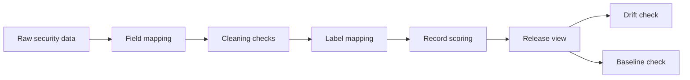

# SecData Forge

SecData Forge is a small Python toolkit for preparing auditable network-security datasets. It focuses on the unglamorous parts that usually decide whether a dataset can be trusted later: field mapping, duplicate checks, label normalization, quality scoring, drift checks, and a simple downstream sanity test.

The project is intentionally light. It runs with the Python standard library, keeps every rule in plain configuration files, and writes artifacts that can be inspected in Git.

## What It Does

- Normalizes heterogeneous flow, alert, log, or threat-intel tables into a consistent schema.
- Finds missing required fields, malformed timestamps, exact duplicates, and near-duplicate text records.
- Maps source labels such as `BENIGN`, `Normal`, `DDoS`, and `PortScan` into a local taxonomy.
- Scores each record across provenance, completeness, label confidence, uniqueness, freshness, and feature usability.
- Summarizes dataset balance with normalized entropy.
- Compares reference and current releases with PSI, KS statistic, and JS divergence.
- Runs a dependency-free nearest-centroid baseline as a quick downstream check.
- Generates release artifacts such as `quality_report.md`, `DATA_CARD.md`, `issues.csv`, and `high_quality.csv`.



## Quick Start

```powershell
python -m pip install -e .
secdata-forge run `
  --input examples/flows/raw_open_security_flows.csv `
  --config configs/security_flow.json `
  --reference examples/flows/reference_open_security_flows.csv `
  --output examples/demo_output
```

Without installing the package:

```powershell
$env:PYTHONPATH = "src"
python -m secdata_forge run `
  --input examples/flows/raw_open_security_flows.csv `
  --config configs/security_flow.json `
  --reference examples/flows/reference_open_security_flows.csv `
  --output examples/demo_output
```

## Commands

```powershell
secdata-forge profile --input examples/flows/raw_open_security_flows.csv --config configs/security_flow.json
secdata-forge drift --reference examples/flows/reference_open_security_flows.csv --current examples/flows/raw_open_security_flows.csv --config configs/security_flow.json
secdata-forge validate --input examples/flows/raw_open_security_flows.csv --config configs/security_flow.json
```

## Output Files

| File | Purpose |
| --- | --- |
| `standardized.csv` | Source records after field and label mapping. |
| `cleaned.csv` | Records kept after basic cleaning and duplicate checks. |
| `quality_scores.csv` | Per-record dimension scores and total score. |
| `high_quality.csv` | Records that pass the configured score threshold. |
| `issues.csv` | Missing fields, duplicates, malformed timestamps, and related findings. |
| `quality_report.md/json` | Dataset-level quality summary. |
| `drift_report.md/json` | Reference-vs-current distribution comparison. |
| `validation_report.json` | Lightweight downstream baseline results. |
| `DATA_CARD.md` | Release notes for a dataset version. |
| `manifest.json` | Checksums and sizes for generated artifacts. |

## Repository Layout

```text
src/secdata_forge/
  standardize.py   # Field and label mapping
  cleaning.py      # Missing-value, timestamp, and duplicate checks
  quality.py       # Record and dataset scoring
  drift.py         # PSI, KS, and JS-divergence checks
  validation.py    # Dependency-free baseline validation
  pipeline.py      # End-to-end orchestration
configs/
  security_flow.json
examples/
  flows/
docs/
  architecture.md
  quality_metrics.md
tests/
```

## Example Snapshot

The demo data under `examples/flows` is synthetic and small enough to review by hand. The generated output currently shows:

- overall quality score: `0.9583`
- high-score record rate: `0.9333`
- detected findings: one exact duplicate and one missing label
- drift status: `update_required`
- baseline check: successful nearest-centroid run on the retained records

## Related Work

SecData Forge is not a replacement for full observability or model-monitoring systems. It keeps the first-pass dataset release workflow simple and inspectable. Related projects worth knowing:

- [Badgers](https://github.com/Fraunhofer-IESE/badgers), a Python library for generating data quality deficits.
- [D3Bench](https://arxiv.org/abs/2404.18673), a benchmark study of open-source drift detection tools.
- [CyNER](https://arxiv.org/abs/2204.05754), a cybersecurity named entity recognition library.

## Roadmap

- Add adapters for common public intrusion-detection and vulnerability datasets.
- Add a review queue for records with weak labels or conflicting sources.
- Add version-to-version release diffs.
- Add optional charts for label balance, drift, and baseline metrics.

## Safety Notes

This repository is meant for metadata, derived features, labels, hashes, and redacted logs. Do not commit raw malware, private packet payloads, credentials, personal data, or exploit code.
