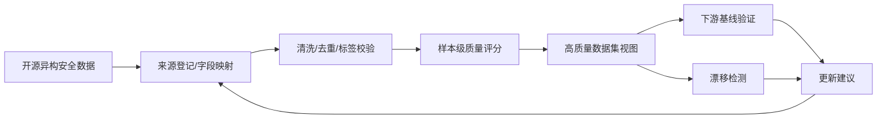

# CyberData Clean

面向“基于开源数据的网络安全高质量数据构建”的轻量级开源工具包。

这个项目不是普通 CSV 清洗脚本，而是把申请书里的技术路线做成可运行原型：多源字段标准化、数据清洗去重、标签归一化、样本级质量评分、数据集级质量报告、漂移检测、下游模型验证和数据卡片生成。

## 为什么与课题高度相关

申请书强调的问题包括开源网络安全数据来源分散、格式异构、标签质量不稳定、类别分布不均衡、数据旧化失效，以及 AI 安全模型对高质量训练数据的需求。CyberData Clean 对应实现了以下闭环：



## 核心能力

- 多源标准化：通过 JSON 配置把不同网络流量、日志、告警或威胁情报字段映射到统一 schema。
- 清洗与去重：检查关键字段缺失、时间戳异常、精确重复和文本近重复样本。
- 标签质量校验：把 BENIGN、Normal、DDoS、PortScan 等异构标签归一化到统一标签体系。
- 质量评估：从来源可信度、完整性、标签可信度、唯一性、时效性、特征可用性 6 个维度生成样本级质量分。
- 类别平衡分析：用归一化熵计算数据集标签分布平衡度。
- 漂移检测：对数值特征计算 PSI/KS，对类别特征计算 JS divergence，判断数据是否需要更新。
- 下游验证：内置无外部依赖的 nearest-centroid baseline，验证清洗筛选后的数据是否更适合模型实验。
- 可追溯交付：自动生成 `quality_report.md`、`quality_report.json`、`DATA_CARD.md`、`issues.csv`、`high_quality.csv`。

## 快速运行

```powershell
python -m pip install -e .
cyberdata-clean run `
  --input examples/flows/raw_open_security_flows.csv `
  --config configs/security_flow.json `
  --reference examples/flows/reference_open_security_flows.csv `
  --output examples/demo_output
```

如果不想安装包，也可以直接设置源码路径：

```powershell
$env:PYTHONPATH = "src"
python -m cyberdata_clean run `
  --input examples/flows/raw_open_security_flows.csv `
  --config configs/security_flow.json `
  --reference examples/flows/reference_open_security_flows.csv `
  --output examples/demo_output
```

## CLI

```powershell
cyberdata-clean profile --input examples/flows/raw_open_security_flows.csv --config configs/security_flow.json
cyberdata-clean drift --reference examples/flows/reference_open_security_flows.csv --current examples/flows/raw_open_security_flows.csv --config configs/security_flow.json
cyberdata-clean validate --input examples/flows/raw_open_security_flows.csv --config configs/security_flow.json
```

## 输出文件

| 文件 | 作用 |
| --- | --- |
| `standardized.csv` | 字段和标签标准化后的数据 |
| `cleaned.csv` | 去重和基础校验后的数据 |
| `quality_scores.csv` | 每条样本的质量维度分和总分 |
| `high_quality.csv` | 达到质量阈值的候选高质量样本池 |
| `issues.csv` | 缺失字段、重复、异常时间戳等问题清单 |
| `quality_report.md/json` | 数据集级质量报告 |
| `drift_report.md/json` | 漂移检测结果和更新建议 |
| `validation_report.json` | 下游基线模型验证结果 |
| `DATA_CARD.md` | 数据卡片，可随数据集版本发布 |

## 项目结构

```text
src/cyberdata_clean/
  standardize.py   # 多源字段与标签标准化
  cleaning.py      # 缺失、异常、重复、近重复检查
  quality.py       # 样本级与数据集级质量评分
  drift.py         # PSI、KS、JS divergence 漂移检测
  validation.py    # 无外部依赖的下游基线验证
  pipeline.py      # 全流程编排
configs/
  security_flow.json
examples/
  flows/
docs/
  architecture.md
  quality_metrics.md
tests/
```

## 与现有开源工作的关系

项目调研了数据质量缺陷生成、漂移检测工具评估和网络安全实体抽取等开源方向，但本仓库代码为面向课题目标的原创实现，默认不依赖第三方库，便于评审直接运行和审查。

- [Badgers](https://github.com/Fraunhofer-IESE/badgers): open-source Python library for generating data quality deficits.
- [D3Bench](https://arxiv.org/abs/2404.18673): benchmark study of open-source drift detection tools such as Evidently, NannyML, and Alibi-Detect.
- [CyNER](https://arxiv.org/abs/2204.05754): cybersecurity named entity recognition library, 可作为未来威胁情报文本结构化模块的参考方向。

## 下一步路线

- 增加 CIC-IDS、UNSW-NB15、漏洞数据、威胁情报文本等真实开源数据集适配配置。
- 增加主动学习式标签复核队列。
- 增加数据版本差异报告和 GitHub Actions 自动质量门禁。
- 增加可视化仪表盘，展示类别分布、漂移趋势和模型验证结果。

## 安全与合规

仓库默认只处理元数据、特征、标签、哈希和脱敏日志。不要提交原始恶意样本、私有流量载荷、凭证、个人信息或可直接复用的攻击代码。涉及敏感安全数据时，优先发布可复现实验脚本、字段说明、数据卡片和派生特征。
