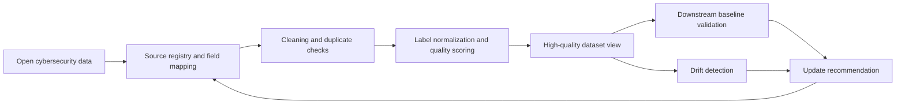

# Architecture

CyberData Clean is designed around the lifecycle described in the funding proposal:

## Modules

- `standardize.py`: maps heterogeneous source fields and labels into a canonical schema.
- `cleaning.py`: checks missing required fields, invalid timestamps, exact duplicates, and near duplicates.
- `quality.py`: scores provenance, completeness, label confidence, uniqueness, freshness, and feature usability.
- `drift.py`: compares reference and current data with PSI, KS statistic, and JS divergence.
- `validation.py`: runs a lightweight nearest-centroid downstream baseline without external dependencies.
- `pipeline.py`: ties the full process together and writes reproducible artifacts.

## Design Choices

- Standard-library only by default, so the demo can run in constrained environments.
- Config-driven field and label mappings, because cybersecurity datasets are heterogeneous.
- Sample-level and dataset-level reports, because reviewers need to see both engineering detail and research metrics.
- Data cards and issue manifests, because traceability is part of dataset quality.

