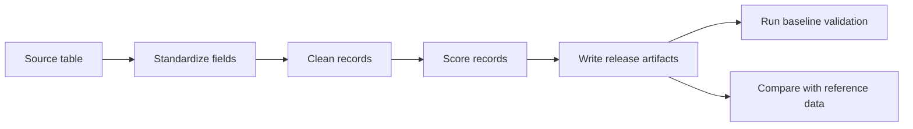

# Architecture

SecData Forge is organized as a plain, file-based pipeline. The goal is to make every dataset release easy to inspect and easy to reproduce.

## Modules

- `standardize.py`: maps source fields and labels into a canonical schema.
- `cleaning.py`: checks missing required fields, invalid timestamps, exact duplicates, and near duplicates.
- `quality.py`: scores provenance, completeness, label confidence, uniqueness, freshness, and feature usability.
- `drift.py`: compares reference and current data with PSI, KS statistic, and JS divergence.
- `validation.py`: runs a lightweight nearest-centroid baseline without external dependencies.
- `report.py`: writes Markdown and JSON summaries for release review.
- `pipeline.py`: ties the full process together.

## Design Notes

- The default path uses only the Python standard library.
- Field and label rules live in JSON configuration files.
- Output files are stable enough to be committed, reviewed, and diffed.
- Raw sensitive artifacts should stay outside the repository; derived features and metadata are preferred.

